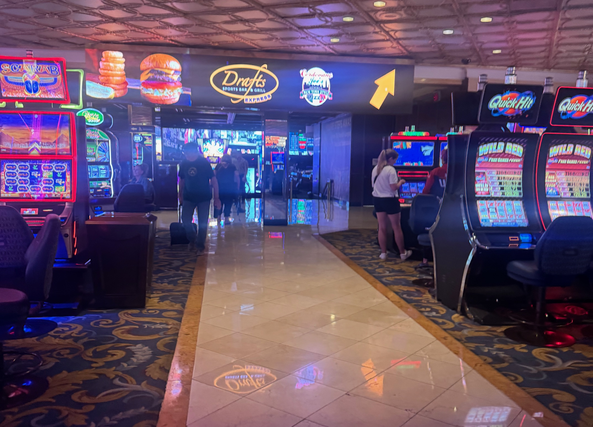

## TL;DR;

Last fall I entered the Westgate SuperContest, the long-running Vegas NFL handicapping contest, with Claude Code as my partner. Contestants in the supercontest make 5 picks every week "against the spread" and the winner is the person with the most correct picks.

I learned three things, and only one of them was about football.

- **Doing things with friends is fun.** You have to buy the entry in person, and have a proxy in Nevada to submit your picks, so I flew to Vegas and did it with a friend. We texted every week after to get the picks in. That was the best part of the whole project, and I'm glad I did it for this reason alone.
- **The Vegas line has most of the information.** I tried a bunch of different approaches across data science and research. In the end, there's a reason Vegas has the edge. Gambling on sports is something that takes real expertise.
- **"Almost done" is the new doomscrolling.** I spent more late nights than I feel good about with Claude, hoping that "one more turn" would get things to a place that was stable enough to carry me through the season.

## How hard can it be?

That phrase has kicked off most of my best and worst decisions. The best of those may have been convincing my wife to get our dog Macho when we were 25 and living in a law school frat house, with no business being parents to anyone including a 9 pound chihuahua. Now that the whole internet's knowledge is a chat window away, the range of things it applies to has gotten a lot wider.

I've wanted to enter the SuperContest since I first heard Bill Simmons talk about it. When it comes to sports betting experiments, it's a clean problem. The contest publishes its lines on Wednesday. You pick five games against those lines. Most correct picks over the season wins. There's no bankroll to manage, no bet sizing, no hedging, and you see everyone else's picks every week.

Which makes it a great test of a question I've been circling as AI has taken on a bigger role in our lives: **what is expertise actually worth?** Is domain knowledge a bar you have to clear to be successful, or is it now something you can rent from a model?

I am not a football gambling expert. But I had Claude Code. How hard could it be?

## You have to go in person

You can't enter the SuperContest online. You have to walk into the Westgate sportsbook in Las Vegas, and hand them the money.

So I got on a plane. My friend Leonard lives in Vegas, and we made a day of it: Leonard, the Westgate, the buy-in, the walk past the giant board of lines that turns everyone into a "well, actually" guy. I wrote the entry name on the form as **BEN+CLAUDE**. The person behind the counter did not ask.

The contest lets you name a proxy, so every week I texted Leonard five picks and he entered them in the app. After Week 1, we were 3-2 and tied for 47th out of about a thousand entries. Game on!

## Almost there

The plan was reasonable. Take open NFL play-by-play data and historical odds, train models to predict how each game does against the spread, then have Claude read the internet every week to sanity-check the picks against what the sharp people were saying.

From the inside, it always felt like I had momentum, not like it was a mess. But the real story is in the commit history. August 30: "implement complete NFL ATS prediction pipeline with baselines." Then, in order: "gigantic." "Going through changes." "I think getting simpler/better." "Approaching clean." And on September 26, the final commit on that repo: **"Think its broken again."** Three weeks in, I created a task for myself that read, verbatim: **"Actually understand how the models in the old project work."**

Every session ended with encouragement. A green checkmark, a summary, "Ready for Week 6 and beyond!" When I said a backtest looked too good, Claude agreed and proposed a fix, and the fix arrived with its own green checkmark. When I wondered out loud whether we needed an experiment registry, it was already building one, and it was excited about it. Four times in a month we restructured the whole codebase, and every one of those felt like a step forward. It never once suggested we might be overbuilding. At the time, it had no idea what "enough" looked like, and it was always game for one more thing.

It was also game at any hour. Claude Code in the fall of 2025 (something that has been fixed since then) had no sense of when work was happening. Eleven at night looked exactly like eleven in the morning. So a lot of this got built between the kids' bedtime and mine, in that mode where the next turn was going to be the one that made it stable. "Almost done" became the new doomscrolling. I wasn't working late because it wasn't working, but rather because it kept almost working and the voice on the other side of the chat was cheerful about it.

The contrast with today is almost funny. Last week, mid-session, Claude told me to go to bed. Unprompted: this is a good stopping point, the rest will look different in the morning. It knows what time it is now. It knows how long we've been at it. It's learned to ask whether the next turn is worth taking. That guardrail didn't exist a year ago, and I've come to think it matters more than any capability jump. The model got smarter, sure. The thing that would have most impacted my September was the tool knowing when to stop.

## The line already knows

A few weeks in, I was on a call about ticketing data with a colleague. I asked how much effort they put into predicting how teams will do.

He shrugged. "Not much. The Vegas line already knows most of that."

I had spent a month trying to beat the Vegas line, and here was a professional whose livelihood depends on game outcomes treating it as a solved input. He wasn't wrong. When I finally did the honest math, a well-built model's edge over the closing line was about two percent. Over five picks a week, two percent is invisible. It's a coin flip with a good origin story.

Week 1 turned out to be the cleanest experiment of the whole season, because I accidentally kept four separate cards:

| Who made the picks | Result |
| :-- | :-- |
| The model, straight | 3-2 |
| The model, after Claude read the experts | **4-1** |
| Me, after flipping one pick on a hunch | 3-2 |
| The crowd's five most popular sides | 1-4 |

That week, Claude read the power ratings, the sharp-money reports, and a handful of columns and podcasts, and came back with two changes. New Orleans was starting a backup quarterback, so drop them. Sharp money was on Pittsburgh, so drop the Jets. Both calls were right. That card would have gone 4-1.

Then I looked at it and flipped Green Bay to Detroit, the opposite side of the model's number-one pick, because I liked the Lions. Green Bay won by fourteen.

So the model was a coin flip. The crowd was worse than a coin flip. My gut gave back a game. The one layer that clearly earned its keep was an agent reading what people who already knew the answer had written down.

**Domain expertise wasn't the bar I had to clear. It was freely available, and the tool was good at absorbing it. The expertise I wasn't using was my operating expertise: knowing what outcome we were after, keeping score against it, and knowing when to call it a night.**

## The free model was there the whole time

On September 30, I gave up on the homegrown system and forked nfelo, a public, open-source NFL model with a decade of history and a maintainer who's been doing this for years.

The fresh start had one genuinely great moment. On day one, Claude trained a model on top of nfelo's data that backtested at 96% accuracy. Same day, it wrote a 458-line post-mortem proving the 96% was fake: the "features" included stats that are only known after the game ends. One of the upstream loaders was quietly filling a missing value with the final score.

Each fix brought the number down. 96%. Then a four-point edge. Then two. Then just under two. That was the honest number, and getting there was the best work the project produced. The peak of the whole exercise was the moment it proved itself wrong.

What actually shipped picks in October was nfelo's public probabilities plus a five-line script to choose the top five. Everything I'd built above that layer had added zero games.

I ended the season 33-32-2. If I had been making $15 bets on every game I would have ended the season down $40 from the vig.

## What I do differently now

I run coding agents inside client businesses every week now on things that matter more than my football picks. This project reminded me how they fail, and the rules I took from it are many of the same simple rules I have learned many times in my career as an operator.

**Buy (for free!) first before building.** nfelo was sitting on the internet the entire time I was building my own version of it, and it was better. Often someone has already built the boring, correct version of what you're about to build. Before the agent writes a line, find that version. Then fork it and spend your effort on the part that's specific to you, which is almost always smaller than you think. An agent is very good at building and not naturally inclined to tell you not to.

**Write down the outcome before starting the work.** It always comes back to being crisp about the problem you're solving, the result you want, and the evidence that will tell you that you got it. For the SuperContest that was a three-column spreadsheet: pick, line, outcome, plus one more column for who made the call. Inside a client business it's the same shape: the workflow that's broken, what "fixed" looks like in a number the team already tracks, and where that number gets written down every week. If you can't write that page, you aren't ready for infrastructure. This is the part the agent can't supply. It will happily optimize whatever is in front of it, so what's in front of it has to be the outcome.

**Distrust the cheerleading.** "Ready for Week 6 and beyond!" is exactly the line that should make you open the file, not close it. The agent's confidence is a writing style, not a measurement.

**Keep the human parts human. Everything is better with friends.** The Vegas trip was the only unambiguous win in the whole project. Some things are better done in person, with a friend.

## Where we landed

I flew to Vegas to find out whether expertise still matters. It does, just not the kind I went to test. Football and ML were both rentable, and the agent rented them well. The expertise the machine couldn't supply was the operator's: naming the outcome, keeping an honest scoreboard, and knowing when to stop. That's the scarce part now, and it's exactly the part we bring to a client business.

Meanwhile, arguably the biggest change in the tools for operators isn't raw capability, it's restraint. A year ago they'd cheer you into one more turn at midnight for eight weeks straight. Today mine tells me to go to bed. The model has the free stuff covered. Knowing what's worth building, when to stop, and when to pivot is still the job.
